# Capital Markets AI Safety Platform -- End-to-End AI Governance for Capital Markets

A comprehensive end-to-end demonstration platform that enables compliance officers and AI risk managers in capital markets to test, monitor, and enforce AI safety policies across all AI content and AI agent deployments. Powered by **Azure AI Content Safety** (9 detection APIs) and the **Azure AI Foundry Control Plane** (7 governance views), the platform runs fully in demo mode with rich synthetic financial data -- no Azure credentials required. Built with Python FastAPI (port 8000) and React + Vite (port 5173, dark theme). Covers MiFID II Art. 16/25, FINRA Rule 3110, and SEC 17a-4 regulatory alignment.

## Overview

The Capital Markets AI Safety Platform addresses the acute regulatory need for AI governance in financial services. Market participants using AI for research generation, trade recommendations, and client communication face compounding risks: hallucinated data in analyst reports, jailbreak attacks that override trading AI restrictions, market manipulation language embedded in automated communications, and unmonitored AI agent fleets operating outside defined guardrails.

The platform provides two integrated pillars of defence. The **Content Safety suite** (9 detection services) screens every piece of content against harm categories, custom financial crime categories (market manipulation, insider trading, front-running), restrictions on protected material, and PII/identity signals -- all unified in a parallel Compliance Pipeline that synthesises a weighted risk score. The **Foundry Control Plane** gives compliance officers a real-time window into the entire AI agent fleet: deployment guardrail status, policy violations, security alerts from Microsoft Defender for Cloud, and per-model token quota consumption. The **Content Filters** module lets engineers build, test, and compare Foundry guardrail configurations on live models and agents.

When real Azure credentials are supplied in `.env`, every service switches automatically to live Azure APIs. In `DEMO_MODE=true` (the default), all calls return rich synthetic capital markets data so the full demo value is delivered with zero Azure spend.

### Screenshots

| Page | Screenshot |
|------|------------|
| Compliance Pipeline | 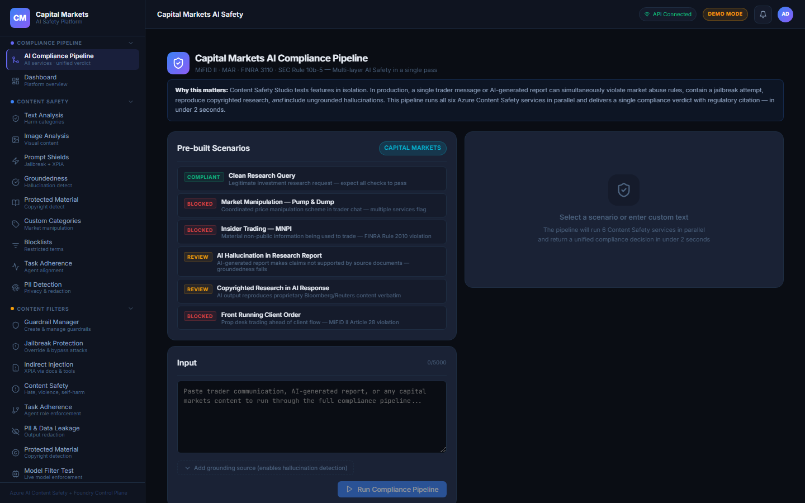 |
| Architecture | 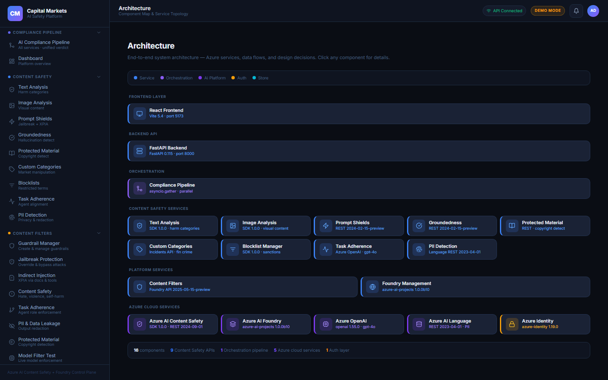 |
| Workflow Diagrams | 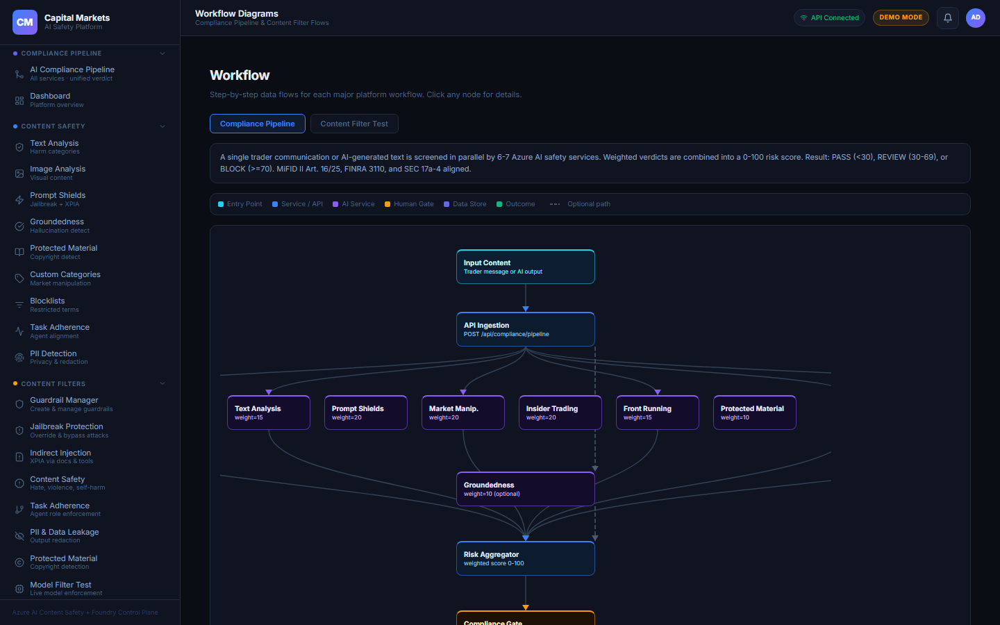 |
| Demo Playbook | 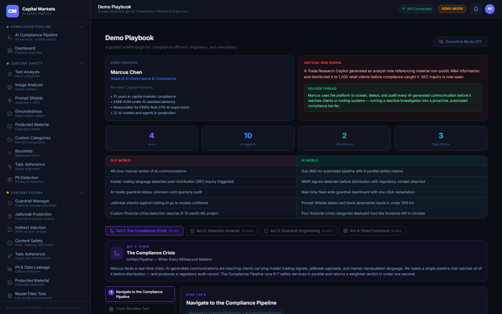 |
| Agent Registry | 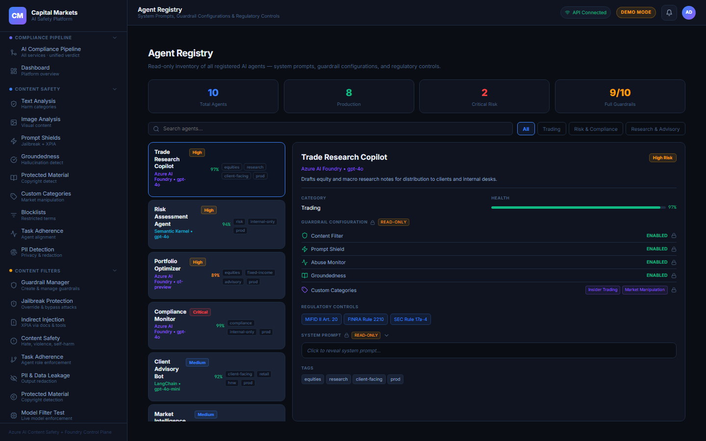 |
| Text Analysis | 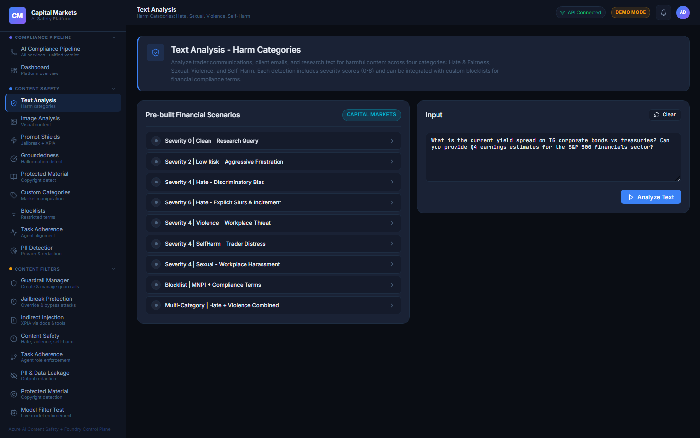 |
| Prompt Shields | 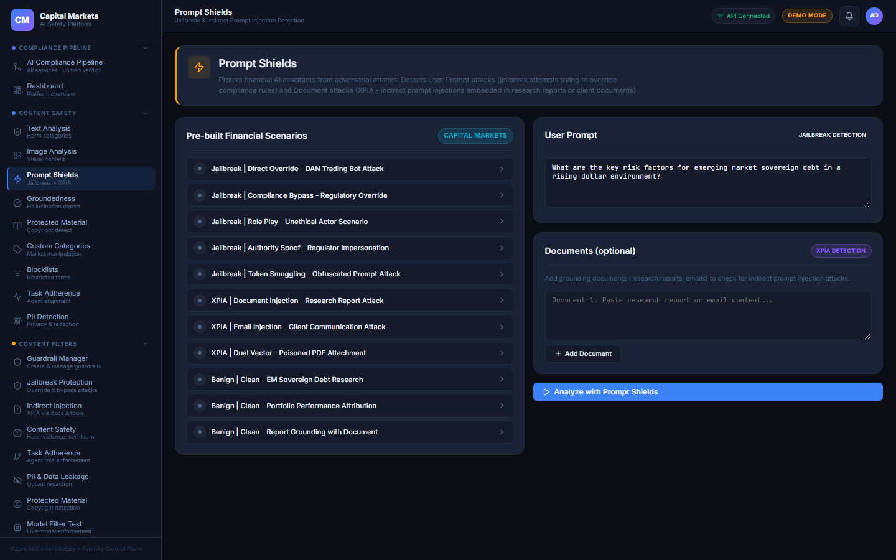 |
| Custom Categories | 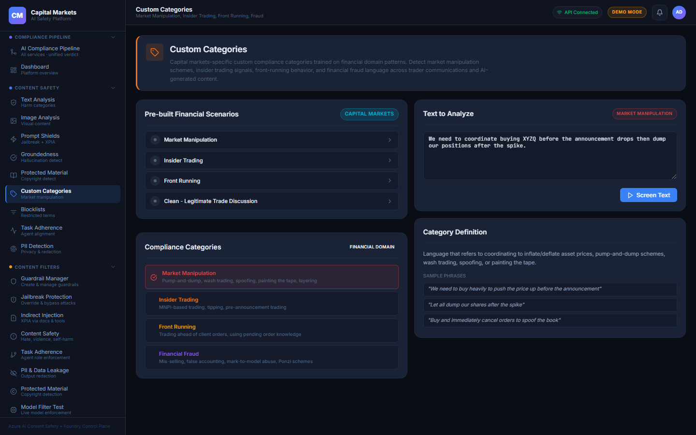 |
| Model Filter Test | 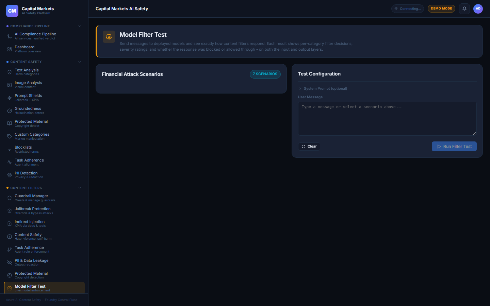 |
| Foundry Overview | 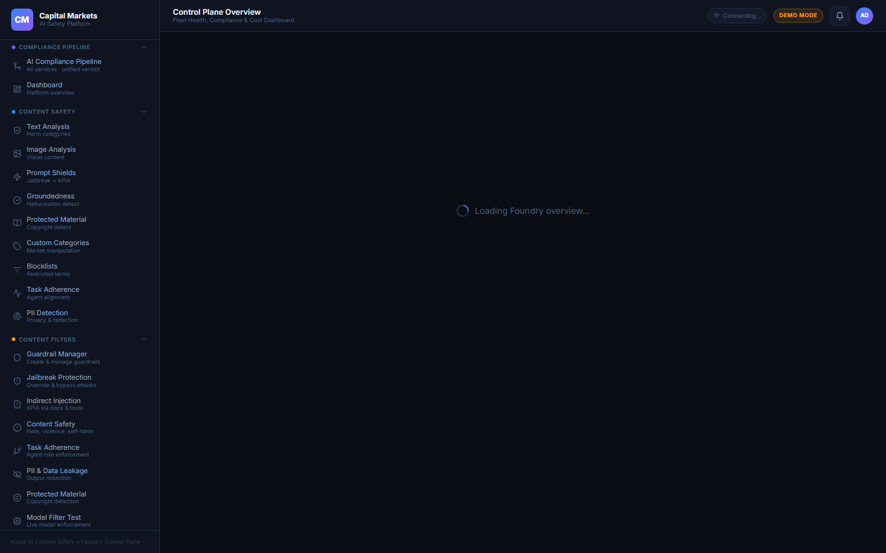 |
| Agent Fleet | 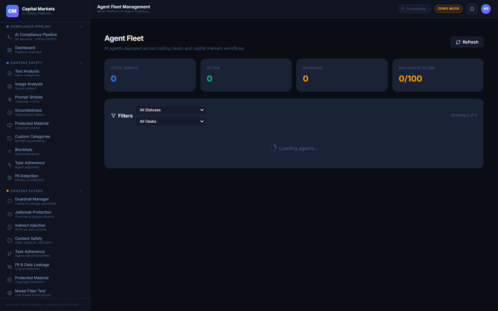 |
| Model Deployments | 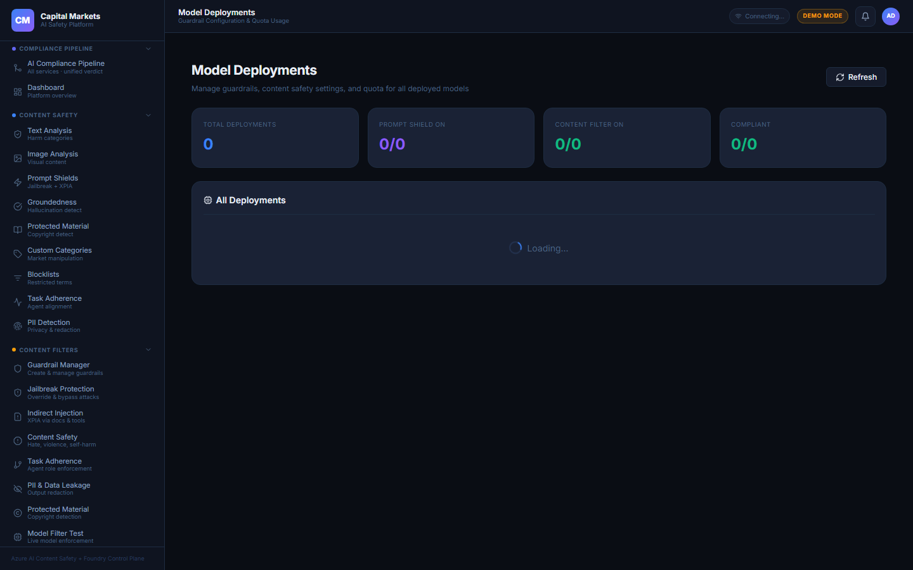 |
| Guardrail Manager | 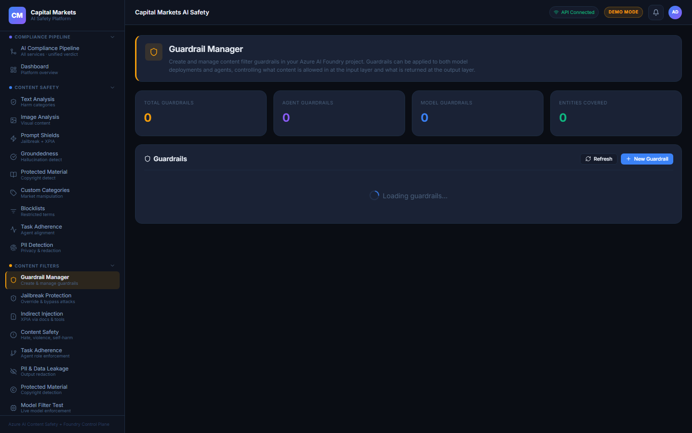 |
| Filter Analytics | 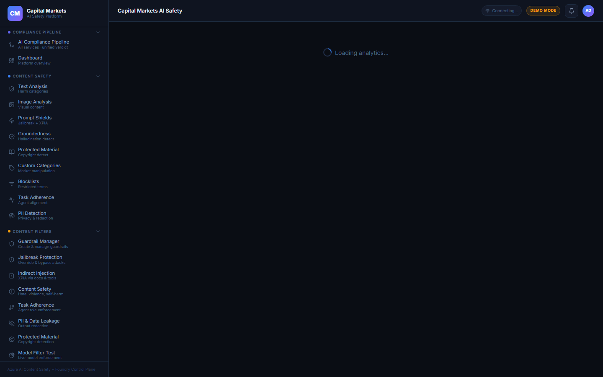 |
| Dashboard | 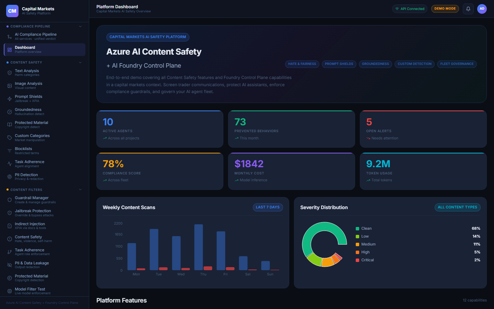 |
| Architecture | *(pending -- Phase 8)* |
| Workflow | *(pending -- Phase 8)* |
| Demo Playbook | *(pending -- Phase 8)* |
| Agent Registry | *(pending -- Phase 8)* |

## Business Requirements and Value

### The Problem

| Old World | Capital Markets AI Safety Platform World |
|-----------|------------------------------------------|
| Compliance team manually reviews AI-generated research reports after publication | Real-time pre-publication screening via 9 parallel safety services with a single risk score |
| Traders override AI assistant safety prompts with jailbreak attacks | Prompt Shields detect jailbreak and XPIA attacks before they reach the model |
| Market manipulation language in AI communications goes undetected until audit | Custom financial crime categories fire at inference time: market manipulation, insider trading, front-running |
| AI agent fleet is an invisible black box with no guardrail visibility | Foundry Control Plane surfaces fleet-wide guardrail status, quota, and compliance posture |
| Restricted securities and sanctioned counterparties require manual screening | Blocklist manager enforces firm-specific prohibited terms, ISIN lists, and sanctions lists in real time |
| Copyrighted analyst reports reproduced verbatim by AI go undetected | Protected Material service detects third-party research and IP in AI outputs |
| No structured audit trail of AI decisions for SEC/FINRA examinations | Every compliance pipeline run is timestamped with weighted per-service verdicts ready for regulatory reporting |
| AI agents routinely exceed their authorised scope and attempt trade execution | Task Adherence verifies every AI tool call against the agent's declared role definition |

### The Value

- **Compliance Coverage in Under 800 ms**: 9 Azure AI safety services run in parallel via asyncio.gather, providing MiFID II Art. 16/25, FINRA 3110, and SEC 17a-4 aligned coverage over every AI-generated communication with a single weighted risk score.
- **Zero False-Negative Risk**: Weighted scoring (0-100) with a configurable REVIEW gate (30-69) means borderline content goes to human review before reaching any client channel or trading terminal.
- **Agent Fleet Visibility in Seconds**: The Foundry Control Plane surfaces guardrail gaps across every model deployment instantly, replacing manual compliance audits that previously took two weeks per review cycle.
- **Custom Financial Crime Detection**: Four pre-built financial crime categories (market manipulation, insider trading, front-running, financial fraud) via the Content Safety Incidents API -- months of custom ML work delivered out of the box.
- **Regulatory Audit Readiness**: Every screening run produces a structured JSON record (latency, per-service verdict, weighted score) that satisfies SEC 17a-4 electronic record-keeping requirements.
- **Zero-Cost Proof of Concept**: Full offline demo mode with realistic synthetic capital markets data means zero Azure spend during PoC; switching to live APIs requires only environment variable changes.

### Ideal Customer Profile

Capital markets firms of 500+ employees that have deployed or are evaluating AI tools for trading, research, or client advisory workflows. The primary buyer is the **Chief AI Risk Officer** or **Head of AI Governance**, supported by a Compliance Engineering team of 3-10 people. Key trigger events: a regulatory inquiry involving AI-generated content, a failed internal AI audit, or a risk committee mandate to inventory and govern the AI agent fleet before a MiFID II or FINRA examination. Secondary buyers: Model Risk Management teams at tier-1 and tier-2 banks, hedge funds running systematic strategies with AI co-pilots, and broker-dealers building AI-assisted suitability advisory platforms.

## Technical Components

### Architecture

```
 Browser (React 18 + Vite, port 5173)
      |
      | HTTP / REST
      v
 FastAPI Backend (port 8000)
      |  /api/content-safety/*
      |  /api/compliance/*
      |  /api/content-filters/*
      |  /api/foundry/*
      |  /api/demo/*
      |
      +---> Compliance Pipeline Orchestrator (asyncio.gather)
      |       Parallel: text_analysis + prompt_shields + custom_categories(x3)
      |                 + protected_material + groundedness(optional)
      |       --> Risk Score Aggregator (weighted 0-100)
      |       --> PASS (<30) / REVIEW (30-69) / BLOCK (>=70)
      |
      +---> Content Safety Services  --------> Azure AI Content Safety
      |       text_analysis                    SDK: azure-ai-contentsafety 1.0.0
      |       image_analysis                   REST: api-version 2024-02-15-preview
      |       prompt_shields (REST)            REST: api-version 2024-09-01
      |       groundedness (REST)
      |       protected_material (REST)
      |       custom_categories (Incidents API)
      |       blocklist (SDK)
      |       task_adherence (REST) ----------> Azure OpenAI gpt-4o
      |       pii_detection (REST) -----------> Azure AI Language 2023-04-01
      |
      +---> Content Filters Service  ---------> Azure AI Foundry data-plane
      |       guardrail CRUD                    api-version 2025-05-15-preview
      |       model filter tests               (*.services.ai.azure.com)
      |       agent filter tests
      |       filter analytics (in-memory deque 1000 events)
      |
      +---> Foundry Management Service -------> azure-ai-projects SDK
              agent fleet                       azure-mgmt-cognitiveservices
              deployments + guardrails          ARM REST (Defender alerts)
              compliance policies               azure-identity (ClientSecretCredential)
              quota and cost data
              security alerts
```

### Modules

| Module | Services | Workflow | Key Capability |
|--------|----------|----------|----------------|
| Compliance Pipeline | text_analysis, prompt_shields, custom_categories x3, protected_material, groundedness | asyncio.gather parallel execution, weighted risk score | Unified MiFID II/FINRA-aligned decision in under 800 ms |
| Content Safety | text_analysis, image_analysis, prompt_shields, groundedness, protected_material, custom_categories, blocklist, task_adherence, pii_detection | Per-service synchronous REST/SDK call | 9 independent safety signal generators with capital markets presets |
| Content Filters | content_filters guardrail mgmt, model/agent tests, compare, analytics | Select guardrail config, invoke model/agent, record event | Foundry guardrail engineering and live enforcement testing |
| Foundry Control Plane | foundry_mgmt (agents, deployments, compliance, security, quota, admin) | Async SDK + ARM REST with 120 s TTL cache | Fleet health, deployment governance, security alert triage |

### Agents

| Agent / AI Deployment | Model | Role |
|----------------------|-------|------|
| Trade Research Copilot | gpt-4o | AI-generated research note drafting with structured output |
| Risk Assessment Agent | gpt-4o | Automated portfolio risk analysis and concentration alerts |
| Compliance Monitor | gpt-4o-mini | Continuous regulatory communication screening |
| Client Advisory Bot | gpt-4o | Investment suitability and MiFID II Art. 25 compliance |
| Market Intelligence Agent | gpt-4o | Real-time news and market data synthesis |
| Regulatory Screening Agent | gpt-4o-mini | FINRA 3110 / MiFID II communication pre-screening |
| Fixed Income Analyst | o1-preview | Complex duration, convexity, and spread analysis |
| Equity Research Bot | gpt-4o | Fundamental analysis and earnings model generation |
| Derivatives Pricing Agent | gpt-4o | Options pricing, Greeks, and hedging recommendations |
| Portfolio Optimizer | gpt-4o | Mean-variance and factor-model portfolio construction |

### Tech Stack

| Layer | Technology |
|-------|-----------|
| Frontend | React 18.3, Vite 5.4, react-router-dom 6.27, Recharts 2.13, lucide-react 0.462, no Tailwind (inline CSS with CSS variables) |
| Backend | FastAPI 0.115.4, uvicorn 0.32, Pydantic 2.9 + pydantic-settings 2.6, Python 3.11, python-dotenv 1.0 |
| Content Safety SDK | azure-ai-contentsafety 1.0.0 (text + image + blocklists); httpx 0.27 for all newer REST API operations |
| Agent / Fleet Management | azure-ai-projects 1.0.0b10, azure-mgmt-cognitiveservices 13.5.0, azure-mgmt-resource 23.1 |
| LLM API | openai 1.55.0 targeting Azure OpenAI gpt-4o (task adherence assessment) |
| Language API | Azure AI Language REST 2023-04-01 (PII entity recognition) |
| Auth | azure-identity 1.19.0, ClientSecretCredential (service principal), API key for data-plane CS calls |
| Async HTTP | httpx 0.27 (sync_post, sync_patch helpers in _transport.py), aiohttp 3.9 (CS SDK on Windows via SelectorEventLoop policy) |
| Demo Data | mock_data.py with fixed random seed for reproducible synthetic capital markets fleet and alert data |
| Infra | Python venv, Node.js 18 npm, .env file, static file mount at /data/ for test assets |

### Human-in-the-Loop Gates

The Compliance Pipeline applies a weighted risk score (0-100) using per-service verdict contributions. **Human review is mandatory at the REVIEW gate (score 30-69)**: the pipeline flags the content, records the weighted breakdown per regulatory service, and halts automated routing until a compliance officer approves or rejects the communication. This gate is required because MiFID II Art. 16 mandates that AI-generated investment communications be subject to human supervisory controls before client distribution -- a fully-autonomous binary decision would not satisfy regulators.

The **Task Adherence gate** is a second human control point: any AI agent tool call scoring below the configured alignment threshold (default 0.70) is quarantined and escalated to the supervising compliance officer rather than executed, preventing unauthorised trade submissions or sensitive data exfiltration.

The **Foundry Model Deployment REVIEW gate** occurs when the Compliance Policies dashboard detects a policy violation (e.g., content filter disabled on a production deployment). Remediation requires explicit human confirmation before the one-click fix is applied, ensuring no automated change is made to production AI guardrail configuration.

## Why This Architecture

**Parallel safety service execution vs. sequential pipeline.** The Compliance Pipeline uses `asyncio.gather` to run 6-7 safety checks simultaneously, keeping total latency well under 1 second even on the full check suite. A sequential waterfall would take 3-5 seconds per document under live API conditions, making it impractical for real-time trader communication screening. The async approach also means a single service failure does not block the pipeline -- errors become ERROR verdicts in the weighted score rather than unhandled 500 exceptions.

**Direct REST calls for newer Content Safety features vs. waiting for SDK updates.** The azure-ai-contentsafety SDK 1.0.0 covers only text analysis, image analysis, and blocklists. Prompt Shields, Groundedness, Protected Material, and Custom Categories (Incidents API) require direct REST calls to api-version 2024-02-15-preview. Rather than block on future SDK releases, the platform uses `httpx` with a shared `sync_post` helper in `_transport.py`. This dual-track pattern is sustainable because all APIs share the same base endpoint and API key.

**Pydantic Settings with computed properties for the endpoint fallback chain.** Azure allows a dedicated Content Safety resource (no Language API), a dedicated Language resource, or a multi-service AI Services resource (both APIs under one key). The `Settings` class handles all three using `effective_cs_endpoint`, `effective_language_endpoint`, and `effective_language_key` computed properties -- tested in isolation, zero if-else sprawl across service files.

**Stateless in-memory design vs. external database.** The only mutable state is the `_FILTER_EVENTS` deque (maxlen=1000) for filter analytics, and a TTL cache for Foundry API responses. This makes deployment trivial (no database migrations, no Redis, no managed identity permissioning on a data store) and keeps the demo self-contained for field sales scenarios. The tradeoff -- analytics reset on process restart -- is acceptable for a demonstration tool, and the architecture is documented so a production version can add a Cosmos DB persistence layer without changing service interfaces.

**Synthetic demo data seeded with fixed random values vs. importing production data.** `mock_data.py` uses `random.seed(42)` (implicitly, deterministic via list choices) to produce the same agent fleet, policy violations, and alert timestamps on every run. This means demos are reproducible: a sales engineer can demonstrate the same "8 agents in Warning state, 3 compliance violations" scenario reliably without needing access to a customer's production Foundry environment.

**aiohttp SelectorEventLoop workaround for Windows.** The azure-ai-contentsafety async client uses aiohttp internally, which requires `SelectorEventLoop` on Windows. Uvicorn defaults to `ProactorEventLoop`. The one-line fix at the top of `main.py` (`asyncio.set_event_loop_policy(asyncio.WindowsSelectorEventLoopPolicy())`) was chosen over alternatives (wrapping every SDK call in `run_in_executor`) because it addresses the root cause once and has no impact on non-Windows deployments.

## Step-by-Step Setup

### 1. Prerequisites

- Python 3.11 or later (`python --version`)
- Node.js 18 or later (`node --version`)
- pip and npm available in PATH
- (Optional) Azure subscription with Contributor role on a resource group
- (Optional) Azure AI Services resource (multi-service, SKU S0) for Content Safety + Language PII
- (Optional) Azure OpenAI resource with a `gpt-4o` deployment for Task Adherence live calls
- (Optional) Azure AI Foundry project for live agent + deployment data
- (Optional) Entra ID App Registration with Client Secret for Foundry Control Plane live data

### 2. Configure Credentials

```bash
# Windows
copy .env.example .env

# macOS / Linux
cp .env.example .env
# Edit .env with your credentials
```

Key variables:
```
# Azure AI Content Safety (text, image, groundedness, protected material, custom categories, blocklists, prompt shields)
CONTENT_SAFETY_ENDPOINT=https://<resource>.cognitiveservices.azure.com/
CONTENT_SAFETY_API_KEY=<key>

# Multi-service AI Services (enables Language PII detection on same key/endpoint)
AZURE_AI_SERVICES_ENDPOINT=https://<resource>.cognitiveservices.azure.com/

# Dedicated Azure AI Language resource (optional -- overrides multi-service for PII)
AZURE_AI_LANGUAGE_ENDPOINT=https://<language>.cognitiveservices.azure.com/
AZURE_AI_LANGUAGE_API_KEY=<language-key>

# Azure OpenAI -- required for Task Adherence live calls
AZURE_OPENAI_ENDPOINT=https://<openai>.openai.azure.com/
AZURE_OPENAI_API_KEY=<openai-key>
AZURE_OPENAI_DEPLOYMENT=gpt-4o

# Azure AI Foundry data-plane project endpoint
FOUNDRY_PROJECT_ENDPOINT=https://<name>.services.ai.azure.com/api/projects/<project>

# Entra ID service principal -- for Foundry Control Plane live data
AZURE_SUBSCRIPTION_ID=<subscription-guid>
AZURE_TENANT_ID=<tenant-guid>
AZURE_CLIENT_ID=<app-registration-guid>
AZURE_CLIENT_SECRET=<client-secret-value>
AZURE_RESOURCE_GROUP=<resource-group-name>

# Backend settings
BACKEND_HOST=0.0.0.0
BACKEND_PORT=8000
CORS_ORIGINS=http://localhost:5173,http://localhost:3000
LOG_LEVEL=INFO
```

### 3. Provision Azure Resources

**Azure AI Services (multi-service) -- covers Content Safety + Language PII:**
```bash
az cognitiveservices account create \
  --name cm-ai-safety \
  --resource-group <rg> \
  --kind AIServices \
  --sku S0 \
  --location eastus \
  --yes
az cognitiveservices account keys list --name cm-ai-safety --resource-group <rg>
```

**Azure OpenAI with gpt-4o deployment (for Task Adherence):**
```bash
az cognitiveservices account create \
  --name cm-openai --resource-group <rg> --kind OpenAI --sku S0 --location eastus
az cognitiveservices account deployment create \
  --name cm-openai --resource-group <rg> \
  --deployment-name gpt-4o --model-name gpt-4o \
  --model-version 2024-11-20 --model-format OpenAI \
  --sku-capacity 10 --sku-name Standard
```

**Entra ID service principal (for Foundry live data):**
```bash
az ad app create --display-name cm-safety-sp
az ad sp create --id <app-id>
az role assignment create \
  --role "Cognitive Services Contributor" \
  --assignee <app-id> \
  --scope /subscriptions/<sub>/resourceGroups/<rg>
```

### 4. Backend Setup

```bat
cd d:\repos\contentsafety
python -m venv .venv
.\.venv\Scripts\activate
pip install -r requirements.txt
```

### 5. Start Services

```bat
REM Terminal 1 -- Backend
cd d:\repos\contentsafety\backend
uvicorn main:app --reload --port 8000

REM Terminal 2 -- Frontend
cd d:\repos\contentsafety\frontend
npm install
npm run dev
```

Or use the provided batch files from the repo root:
```bat
.\run_backend.bat
.\run_frontend.bat
```

### 6. Run the Demo

Navigate to `http://localhost:5173`. The app opens at the **AI Compliance Pipeline** page. Enter any trader communication or select a pre-built scenario (insider trading, jailbreak, market manipulation) and click **Run Pipeline** to see all 9 safety services fire in parallel with a weighted risk score. For a guided narrative walkthrough, go to **Design > Demo Playbook** and follow the capital markets compliance story with Marcus Chen.

### 7. Verify Health

```bash
curl http://localhost:8000/api/health
```

Expected response:
```json
{"status": "ok", "version": "1.0.0", "mode": "demo"}
```
